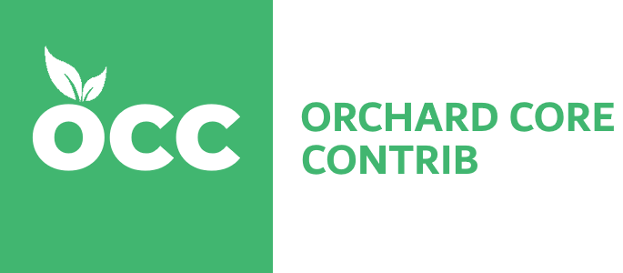

# OrchardCoreContrib.PoExtractor



`OrchardCoreContrib.PoExtractor` is distributed as a dotnet global tool to extracts translatable strings from the C# and VB code, Razor templates and Liquid templates to POT (portable object template) files. It is designed to follow conventions used in the [OrchardCore](https://github.com/OrchardCMS/OrchardCore) project.

## Installation

Install with the following command:

```powershell
dotnet tool install --global OrchardCoreContrib.PoExtractor
```

## Usage

```powershell
extractpo <INTPUT_PATH> <OUTPUT_PATH> [-l|--language {"C#"|"VB"}] [-t|--template {"razor"|"liquid"}]
```

### Description

Extracts all translatable strings from projects at the specified input path and saves generated POT files at the specified output path. It creates one POT file per a project. This includes liquid views.

### Arguments

- **`INTPUT_PATH`**

The path to the input directory, all projects at the the path will be processed.

- **`OUTPUT_PATH`**

The path to a directory where POT files will be generated.

### Options

- **`-l|--language {C#|VB}`**

Specifies the code language to extracts translatable strings from. Default: `C#` language

- **`-t|--template {"razor"|"liquid"}`**

Specifies the template engine to extract the translatable strings from. Default: `Razor` & `Liquid` templates.

- **`-p|--plugin {path or URL to CSX file}`**

Specifies a path to a C# script file that can define further project processors. (You can find an example script [here](test/OrchardCoreContrib.PoExtractor.Tests/PluginTestFiles/BasicJsonLocalizationProcessor.csx).) This can be used to process localization from code languages or template engines not supported by the above options. You can have multiple of these switches in one call to load several plugins simultaneously. If the argument starts with `https://` then it's treated as a web URL and the script at that address is downloaded into memory and executed instead of a local file.

When executing the plugins, all _OrchardCoreContrib.PoExtractor_ assemblies are automatically loaded, and two globals are defined:

- `List<IProjectProcessor> ProjectProcessors`: Add an instance of your custom `IProjectProcessor` implementation type to this list.
- `List<string> ProjectFiles`: In the unlikely case that you have to add a new project file type (such as _.fsproj_) add the project file paths to this list.

> [!TIP]
> You can't import NuGet packages in your script file, but you can import local DLL files using the `#r "path/to/package.dll"` directive. The path can be relative to the script file's location so you can import packages from the build directory of the project you are extracting from. This can be especially useful if you launch the tool as using MSBuild as a post-build action. (For remote scripts loaded with a URL, the path can be relative to the current working directory.) For example:
> 
> ```csharp
> #r "src/Modules/OrchardCore.Commerce/bin/Debug/net8.0/OrchardCore.Commerce.dll"
> using OrchardCore.Commerce.Constants;
> Console.WriteLine("Imported resource name: {0}", ResourceNames.ShoppingCart);
> ```

## Uninstallation

```powershell
dotnet tool uninstall --global OrchardCoreContrib.PoExtractor
```

## Limitations

OrchardCoreContrib.PoExtractor assumes, the code follows several conventions:

* `IStringLocalizer` or a derived class is accessed via a field named `S` (This is a convention used in Orchard Core)
* `IHtmlLocalizer` or a derived class is accessed via a field named `H` (This is a convention used in Orchard Core)
* `IStringLocalizer` or `IHtmlLocalizer` is accessed via a field named `T` (This is a older convention used in Orchard Core)
* Liquid templates use the filter named `t` (This is a convention used in Fluid)
* context of the localizable string is the full name (with namespace) of the containing class for C# or VB code
* context of the localizable string is the dot-delimited relative path the to view for Razor templates
* context of the localizable string is the dot-delimited relative path the to template for Liquid templates
 
## Example

C# code:
```csharp
namespace OrchardCore.ContentFields.Fields { 
    public class LinkFieldDisplayDriver : ContentFieldDisplayDriver<LinkField> {
        private IStringLocalizer S;

        public LinkFieldDisplayDriver(IStringLocalizer<LinkFieldDisplayDriver> localizer) {
            S = localizer;
        }

        public override async Task<IDisplayResult> UpdateAsync(LinkField field, IUpdateModel updater, UpdateFieldEditorContext context) {
            bool modelUpdated = await updater.TryUpdateModelAsync(field, Prefix, f => f.Url, f => f.Text);

            if (modelUpdated)
            {
                var settings = context.PartFieldDefinition.Settings.ToObject<LinkFieldSettings>();

                if (settings.Required && String.IsNullOrWhiteSpace(field.Url))
                {
                    updater.ModelState.AddModelError(Prefix, S["The url is required for {0}.", context.PartFieldDefinition.DisplayName()]);
                }
            }

            return Edit(field, context);
        }
    }
}
```

VB code:
```vb
Namespace OrchardCore.Modules.GreetingModule 
    Public Class Greeting
        private readonly S As IStringLocalizer(Of Greeting)

        Public Sub New(ByVal localizer As IStringLocalizer(Of Greeting))
            S = localizer
        End Sub

        Public Sub Saulation(byVal name As String)
            Console.WriteLine(S("Hi {0} ...", name))
        End Sub
    End Class
End Namespace
```

Razor view:
```html
@model OrchardCore.ContentFields.ViewModels.EditLinkFieldViewModel

<div class="row">
    <fieldset class="form-group col-md-12">
        <label asp-for="Url">@Model.PartFieldDefinition.DisplayName()</label>
    </fieldset>
    <fieldset class="form-group col-md-6" asp-validation-class-for="Url">
        <input asp-for="Url" class="form-control content-preview-text" placeholder="@settings.UrlPlaceholder" required="@isRequired" />
    </fieldset>
    <fieldset class="form-group col-md-6" asp-validation-class-for="Text">
        <label asp-for="Text" @if (settings.LinkTextMode == LinkTextMode.Required) { <text> class="required" </text>  }>@T["Link text"]</label>
        <input asp-for="Text" type="text" class="form-control content-preview-text" placeholder="@settings.TextPlaceholder" required="@isTextRequired" />
    </fieldset>
</div>

```

Liquid template:
```html
div class="page-heading">
   <h1>{{ "Page Not Found" | t }}</h1>
/div>

```

Generated POT file:
```
#: OrchardCore.ContentFields\Drivers\LinkFieldDriver.cs:59
#. updater.ModelState.AddModelError(Prefix, T["The url is required for {0}.", context.PartFieldDefinition.DisplayName()]);
msgctxt "OrchardCore.ContentFields.Fields.LinkFieldDisplayDriver"
msgid "The url is required for {0}."
msgstr ""

#: OrchardCore.Modules.GreetingModule\Greeting.vb:94
#. Console.WriteLine(S("Hi {0} ...", name))
msgctxt "OrchardCore.Modules.GreetingModule.Greeting"
msgid "Hi {0} ..."
msgstr ""

#: OrchardCore.ContentFields\Views\LinkField.Edit.cshtml:32
#. <label asp-for="Text" @if (settings.LinkTextMode == LinkTextMode.Required) { <text> class="required" </text>  }>@T["Link text"]</label>
msgctxt "OrchardCore.ContentFields.Views.LinkField.Edit"
msgid "Link text"
msgstr ""

#: TheBlogTheme\Views\Shared\NotFound.liquid:0
msgctxt "TheBlogTheme.Views.Shared.NotFound"
msgid "Page Not Found"
msgstr ""
```

## Credits

**PoExtractor**

https://github.com/lukaskabrt/PoExtractor

Lukas Kabrt
